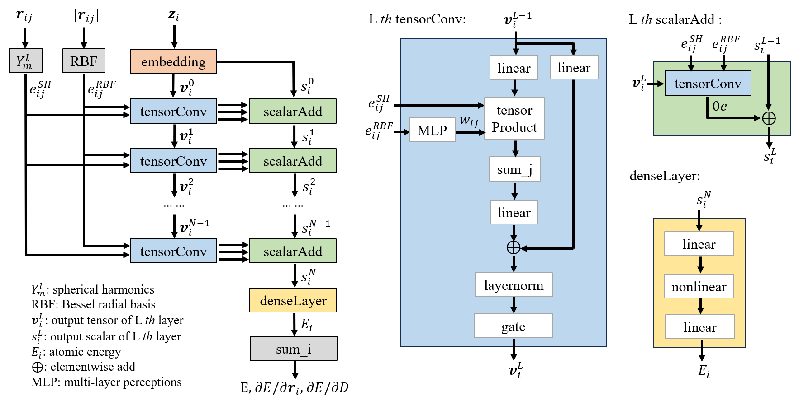
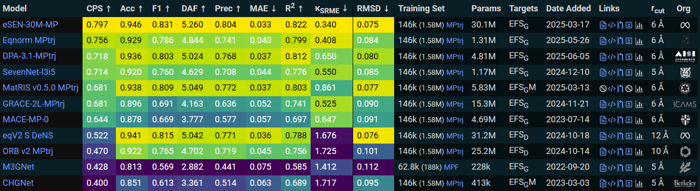

# Eqnorm

## Introduction

We propose a novel E(3)-equivariant GNN-based MLIP eqnorm, which employs a dual-branch design: one branch updates high-order tensor features to capture geometric symmetries, while the other one refines scalar embeddings by extracting information from the tensor branch.


Figure 1. Eqnorm architecture.

Trained on the MPtrj dataset, eqnorm ranks second among state-of-the-art models on the Matbench Discovery leaderboard for physical property prediction.


Figure 2. Matbench discovery compliant models leaderboard. See [Matbench Discovery](https://matbench-discovery.materialsproject.org/).

We used the exact benchmark code found in [mace_benchmark](https://github.com/ACEsuit/mace/blob/main/tests/test_benchmark.py) with mace-torch v0.3.12 (PyPi) to test MD simulation using different MLIPs. To create a fair comparison, All models are benchmarked using the standard Python (3.10) runtime with Pytorch v2.6.0 and CUDA 11.8. No compile/torchscript was used. Notably, eqnorm achieves a fivefold improvement in inference speed over the leading model, eSEN, while enabling simulations of systems threefold larger in size.

Table 1. Inference efficiency test of MD simulation with 1 fs/step on a single Nvidia A40-48G GPU (speed in ns per day / consumed GPU memory).

| Model | 64 atoms | 216 atoms | 512 atoms | 1000 atoms | 1728 atoms |
| :---: | :------: | :-------: | :-------: | :-------: | :--------: |
| Eqnorm MPtrj | 0.6729 / 2.0 G | 0.2382 / 5.8 G | 0.1028 / 13.2 G | 0.05311 / 25.3 G | 0.02999 / 44.8 G |
| eSEN-30M-MP | 0.1489 / 12.0 G | 0.04941 / 38.5 G | OOM | OOM | OOM |
| MACE-MP-0 | 2.3171 / 1.3 G | 0.9178 / 3.6 G | 0.4054 / 7.9 G | 0.2130 / 15.2 G | 0.1244 / 25.8 G |

## Installation

### Requirement

```text
python>=3.10
torch>=2.6.0
torch_scatter
```

for example, install torch-2.6 with cuda 11.8 and torch_scatter:

```bash
conda create -n eqnorm python=3.10
conda activate eqnorm
pip install torch==2.6.0 torchvision==0.21.0 torchaudio==2.6.0 --index-url https://download.pytorch.org/whl/cu118
pip install torch_scatter -f https://data.pyg.org/whl/torch-2.6.0+cu118.html
```

After installation of PyTorch, run the following command:

```bash
pip install git+https://github.com/yzchen08/eqnorm.git
```

## Usage

### ase calculator

```python
from eqnorm.calculator import EqnormCalculator
calc = EqnormCalculator(model_name='eqnorm', model_variant='eqnorm-mptrj', device='cuda')
```

you can check all available ckpt, for now only eqnorm-mptrj is available:

```python
from eqnorm.calculator import EqnormCalculator
print(EqnormCalculator.url_dict)
```
